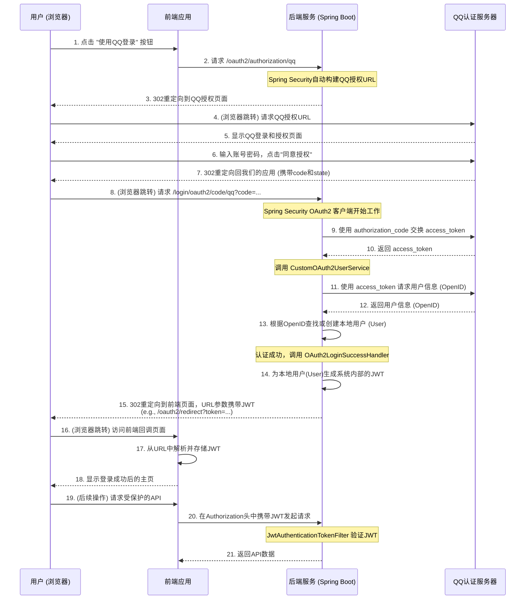

# OAuth2 (QQ登录) 与 JWT 认证体系整合笔记

本文档旨在深入剖析本项目中如何将外部 OAuth2 认证（以QQ登录为例）与内部 JWT 认证体系进行完美融合。

## 核心设计思想

我们将两种认证体系的整合，遵循了一个核心原则：**外部认证，内部授权**。

- **外部认证 (OAuth2)**: OAuth2 流程本身**只负责一件事**：向我们权威地证明“这个用户确实是某某QQ号的主人”。它是一个**身份验证**的过程。
- **内部授权 (JWT)**: 一旦用户的身份被外部提供商（QQ）确认，我们的系统就**接管**后续的所有流程。我们会为这个用户生成我们自己系统的“通行证”——JWT。此后，该用户访问我们所有受保护的API时，都**只使用**这个JWT。

这种设计的最大优势在于**解耦**：
1.  **前端的统一性**：无论用户是通过用户名密码登录，还是通过QQ登录，前端最终拿到的都是我们系统签发的JWT。前端的后续API请求逻辑完全统一，无需关心用户的登录方式。
2.  **后端的统一性**：我们的所有业务API（例如 `/api/test/**`）都只认我们自己签发的JWT，安全验证逻辑高度统一。
3.  **可扩展性**：未来接入微信、GitHub等其他OAuth2提供商时，只需增加新的外部认证分支，而对我们内部的授权体系和API逻辑**零侵入**。

## 关键组件职责剖析

### 1. `CustomOAuth2UserService`
- **定位**: OAuth2 认证成功后的**“用户数据处理器”**。
- **触发时机**: 当用户在QQ授权页面同意授权，并被重定向回我们的应用后，Spring Security 会用获取到的`access_token`去调用QQ的API获取用户信息，然后立即调用这个Service。
- **核心职责**:
    1.  **解析用户信息**: 从QQ返回的特殊JSONP响应中，解析出用户的唯一标识 `OpenID`。
    2.  **用户同步**: 根据`OpenID`查询我们的`t_user`表。
        - **用户已存在**: 如果`"qq_" + openId`的用户已存在，直接加载该用户。
        - **用户不存在**: 自动在`t_user`表中创建一个新用户（自动注册），并赋予一个默认角色（如`ROLE_USER`）。
    3.  **构建认证主体**: 将数据库中的`User`实体和其权限信息，封装成一个我们自定义的`LoginUser`对象并返回。这个`LoginUser`对象现在是Spring Security内部的“已认证用户”。

### 2. `OAuth2LoginSuccessHandler`
- **定位**: OAuth2 认证流程**完全成功**后的**“后处理器”**。
- **触发时机**: 在`CustomOAuth2UserService`成功返回一个`LoginUser`对象后，此处理器立即被调用。
- **核心职责**:
    1.  **获取认证用户**: 从`Authentication`对象中，提取出刚刚由`CustomOAuth2UserService`创建的`LoginUser`实例。
    2.  **签发内部Token**: 调用`JwtUtil`，为这个`LoginUser`生成我们系统内部统一的JWT。
    3.  **重定向交付**: 将生成的JWT作为URL参数，**重定向**到一个前端指定的回调页面（例如 `http://localhost:3000/oauth2/redirect?token=...`）。前端的这个页面负责从URL中接收并存储这个JWT。

### 3. `SecurityConfig` 中的 `oauth2SecurityFilterChain`
- **定位**: OAuth2 流程的**“专用安全通道”**。
- **核心职责**:
    1.  **精准匹配**: 通过`securityMatcher`，声明自己只处理与OAuth2相关的路径（如`/login/oauth2/**`）。
    2.  **启用并配置OAuth2登录**:
        - 开启`.oauth2Login()`功能。
        - 将我们自定义的`CustomOAuth2UserService`配置为`userInfoEndpoint`的用户服务，替换掉默认实现。
        - 将我们自定义的`OAuth2LoginSuccessHandler`配置为`successHandler`，接管认证成功后的流程。

## 端到端流程图 (Mermaid Sequence Diagram)

## 配置要点回顾

- **`pom.xml`**: 必须包含`spring-boot-starter-oauth2-client`依赖。
- **`application.yml`**:
    - 必须在`spring.security.oauth2.client`下正确配置`registration`和`provider`信息。
    - `client-id`和`client-secret`必须替换为自己的真实凭证。
    - `redirect-uri`必须与QQ互联平台上填写的回调地址**完全一致**。
- **`SecurityConfig.java`**:
    - 必须有**至少三个**`SecurityFilterChain` Bean，且使用`@Order`定义了正确的优先级。
    - OAuth2专用的过滤器链必须通过`securityMatcher`精准匹配路径。
    - 必须在`.oauth2Login()`中正确配置自定义的`userService`和`successHandler`。
    
通过以上组件的协同工作，我们构建了一个健壮、可扩展且逻辑清晰的、集成了外部OAuth2提供商的统一认证授权平台。 